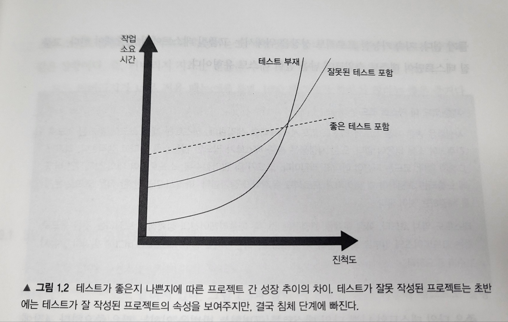

# 1부 1장. 단위테스트의 목표

1. 단위테스트의 목표 정의하는 방법
2. 좋은 테스트와 좋지 않은 테스트를 구별하는 방법

## 단위테스트 현황
- 제품 코드 : 테스트 코드 비율 = 1:3 ~ 1:10 (제품 코드 한 줄 당 테스트 코드 세 줄)


## 단위테스트의 목표
- 소프트웨어 프로젝트의 지속 가능한 성장을 가능하게 하는 것.
- 테스트가 없는 프로젝트의 경우 시작은 유리하지만, 나중에는 진척이 없을 정도로 느려진다.

  
  
  - "소프트웨어 엔트로피" : 코드베이스에서 무언가를 변경할 때마다 무질서도가 증가하여 개발 속도가 빠르게 감소하는 현상.
  - 하나의 버그를 수정하면 더 많은 버그를 양산하고, 한 부분을 수정하면 다른 부분이 고장난다. => 코드를 신뢰할 수 없게 됨.
  - => 테스트로 이러한 경향을 뒤집을 수 있다. Regression에 대한 보험 제공.
- **코드는 자산이 아니라 부채다.** 코드가 많아질수록 잠재적인 버그에 노출되는 표면적이 늘어나고 유지비가 증가한다.     
   테스트 코드도 테스트 스위트 내에 가치있는 테스트만 남기고 모두 제거해라. 
  
## 테스트 스위트 품질 측정을 위한 커버리지 지표
- 코드 커버리지 (== 테스트 커버리지) : 테스트로 실행된 제품 코드 라인 수 / 전체 제품 코드 라인 수
  - 코드 리팩토링을 통해 테스트 실행 시 모든 라인을 거치게 한다면 코드 커버리지가 올라가는 장난질을 칠 수 있음.
- 분기 커버리지: 테스트 실행 시 통과한 분기 수 / 전체 제품 코드 내 분기 수
- 커버리지 숫자를 목표로 하면 안되는 이유 2가지:
  - 커버리지 숫자가 높다고 모든 결과를 검증한다고 볼 수 없음
    - 실제로 검증 없이 (Assert 문 없이) 코드 커버리지, 분기 커버리지 100% 목표로만 테스트코드 작성하는 경우도 있음.
  - 커버리지 지표로는 외부 라이브러리 코드 경로를 고려할 수 없음
    - ```c#
      // 코드 커버리지, 분기 커버리지 모두 100%이나, parse 메소드 내부 경로 고려 못함.
      public static int parse(string input) {
          return int.parse(input); 
      }

      pubic void test(){
          int result = parse("5"); // null, "", "5", "정수가 아님" 등 여러 엣지케이스가 있음.
          Assert.equal(5, result);
      }
      ```
- ==> 커버리지 지표만으로는 테스트가 철저한지, 충분한지 알 수 없음.
- 커버리지는 지표 자체만으로 봐야지 목표가 되어서는 안됨.
  - 단, 커버리지 숫자가 낮으면(60% 미만) 문제 징후다. 코드베이스에 테스트되지 않은 코드가 많다는 뜻. (높은 건 별 의미 없음) 
  - 그래도 시스템의 핵심 부분은 커버리지를 높게 두는 것이 좋다.
- IntelliJ의 테스트코드 configuration에서 coverage 설정, 테스트 코드 실행 시 Run test with coverage 해보기.
  - [IntelliJ 테스트 코드 커버리지 설정 방법](https://seungpnag.tistory.com/5)

## 무엇이 성공적인 테스트 스위트를 만드는가?
1. 개발 주기에 통합되어 있다
  - 이상적으로는, 코드 변경 시마다 테스트를 수행한다.
2. 코드베이스에서 가장 중요한 부분만을 대상으로 한다.
  - 가장 중요한 부분: 비즈니스 로직(도메인 모델)이 있는 부분. => 시간 투자 대비 최고의 수익
  - 그 외 중요한 부분: 인프라 코드, DB/서드파티 시스템과의 종속성, 모든 것을 하나로 묶는 코드
  - 중요하지 않은 부분은 단위테스트가 아닌 통합테스트에서도 검증 가능하다.
  - ==> **코드베이스 중 도메인 모델과 중요하지 않은 부분을 분리해야, 단위 테스트에 대한 노력을 도메인 모델에만 집중할 수 있다.**
  - 즉, 코드 설계를 할 때 테스트를 해야 하는 부분과 그렇지 않은 부분을 분리할 수 있도록 설계해야 한다.
3. 최소한의 유지비로 최대의 가치를 끌어낸다.
  - 가치 있는 테스트 식별하기
  - 가치 있는 테스트 작성하기

