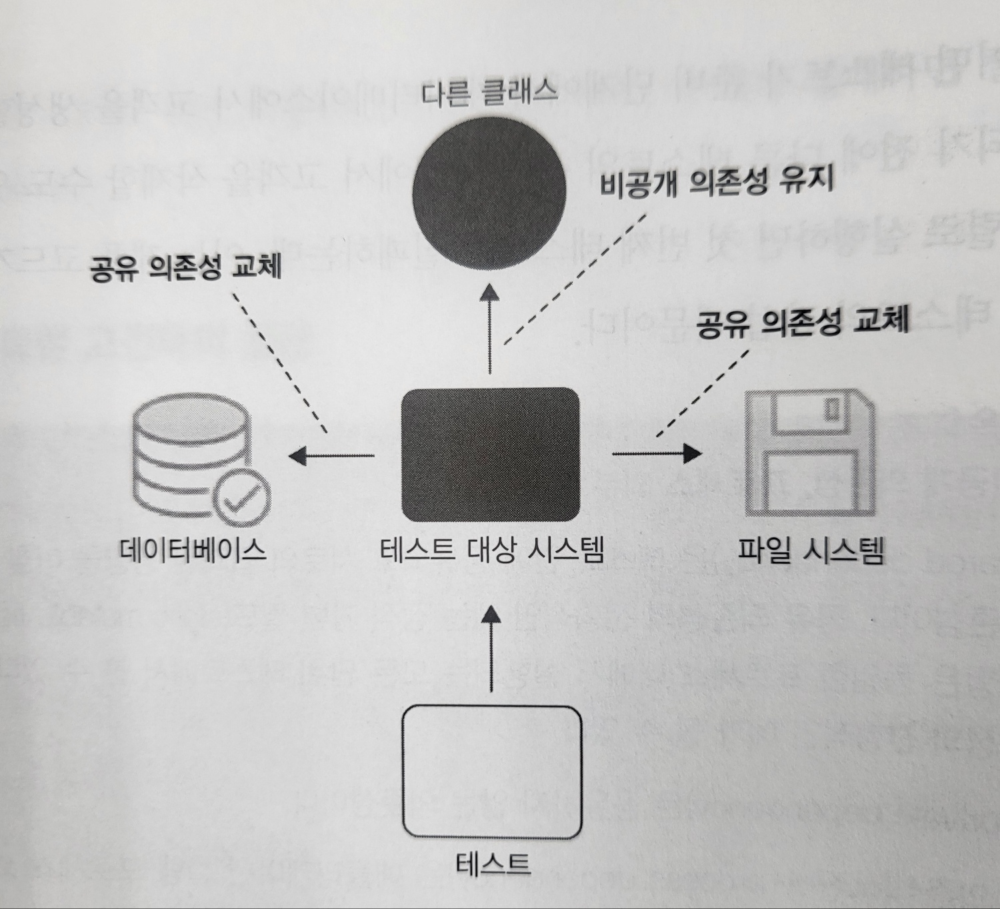

# 1부 2장. 단위테스트란 무엇인 

1. 단위테스트란
2. 공유 의존성, 비공개 의존성, 휘발성 의존성 간의 차이점
3. 단위테스트의 두 분파
4. 단위테스트, 통합테스트, E2E 테스트의 차이점

## 단위테스트의 정의
1. 작은 코드 조각을 검증하고
2. 빠르게 수행하고
3. 격리된 방식으로 처리하는 자동화된 테스트.
    - 격리 문제가 고전파와 런던파를 구분할 수 있는 근원적 차이.

#### 코드 조각을 격리된 방식으로 검증한다는 의미는?
1. 런던파
    - 격리 주체: 테스트 대상 시스템(SUT, System Under Test)을 협력자(의존성)와 격리
    - 단위의 크기: 단일 클래스
    - Test double 사용 대상: 불변 의존성 외 모든 의존성
        > ##### "Test double"이란?   
        > xUnit Test Patterns의 저자인 제라드 메스자로스(Gerard Meszaros)가 만든 용어로, 테스트를 진행하기 어려운 경우 이를 대신해 테스트를 진행할 수 있도록 만들어주는 *가짜 의존성 객체*를 말한다.   
        > 예를 들어 우리가 데이터베이스로부터 조회한 값을 연산하는 로직을 구현했다고 하자.   
        > 해당 로직을 테스트하기 위해선 항상 데이터베이스의 영향을 받을 것이고, 이는 데이터베이스의 상태에 따라 다른 결과를 유발할 수도 있다.   
        > 이렇게 테스트하려는 객체와 연관된 객체를 사용하기가 어렵고 모호할 때 대신해 줄 수 있는 객체를 테스트 더블이라 한다.
        > 자바의 Mockito 같은 것.

    - 장점
      1. 테스트가 실패하면 코드베이스의 어느 부분이 고장났는지 확실히 알 수 있다.
      2. 객체 그래프를 분할할 수 있다. 클래스의 직접적인 의존성을 대체할 수 있다.
      3. 한 번에 한 클래스만 테스트하고, 의존성(협력자)은 다 test double로 하면, 전체 단위 테스트 스위트를 간단한 구조로 설계할 수 있다.
         - (예시)
         - 클래스 1 테스트 -> 클래스 1
         - 클래스 2 테스트 -> 클래스 2
         - ...

    - 테스트 코드 예시: test double로 협력자(의존성)를 대체하여 테스트.
    ```c#
    public void Purchase_succeeds_when_enough_inventory()
        var storeMock = new Mock<IStore>(); // Store 구체 클래스가 아닌 Store의 인터페이스 IStore로부터 Mock 생성. 구체 클래스에서 Mock 생성하는 것은 안티 패턴.
        storeMock
            .Setup(x => x.HasEnoughInventory(Product.Shampoo, 5))
            .Returns(true);
        var customer = new Customer();
        
        // 실행
        bool success = customer.Purchase(
            storeMock.Object, Product.Shampoo, 5);
        
        // 검증
        Assert.True(success);
        storeMock.Verify(
            x => x.RemoveInventory(Product.Shampoo, 5), // store의 상태를 확인하는 것이 아니라, customer과 store의 상호작용(메소드 호출 여부, 횟수)를 검증한다. 
            Times.Once);
    }

    public void Purchase_fails_when_not_enough_inventory()
    {
        // 준비
        var storeMock = new Mock<IStore>();
        storeMock
            .Setup(x => x.HasEnoughInventory(Product.Shampoo, 5))
            .Returns(false);
        var customer = new Customer();
        
        // 실행
        bool success = customer.Purchase(
            storeMock.0bject, Product.Shampoo, 5);
        
        // 검증
        Assert.False(success);
        storeMock.Verify(
            X => X. RemoveInventory(Product. Shampoo, 5),
            Times.Never);
    }
    ```


2. 고전파:
    - 격리 주체: 단위테스트 간의 격리
    - 단위의 크기: 단일 클래스 또는 여러 클래스의 세트
    - Test double 사용 대상: 공유 의존성
       - 데이터베이스, 파일 시스템 등 테스트 간 간섭을 줄 수 있는 항목에 대해서만 test double을 사용한다.   
       - 공유 의존성을 대체하면 각각의 테스트를 격리하고, 테스트 실행 속도를 높일 수 있다.
       > (참고) 의존성의 종류
       > - 공유 의존성: 테스트 간에 공유되고 서로의 결과에 영향을 미칠 수 있는 의존성. Test double 사용 필요. (예시) 정적 가변 필드, 데이터베이스.
       > - 비공개 의존성: 공유하지 않는 의존성. Test double 사용 안함. (예시) 설정 클래스.
       > - 프로세스 외부 의존성: 애플리케이션 실행 외부에서 실행되는 의존성. (예시) 데이터베이스. 단, 테스트 시마다 도커로 새로 데이터베이스를 띄우는 경우, 프로세스 외부 의존성이나 공유 의존성이 아님.
   
    

    - 테스트 코드 예시: Store 만 Mock 처리.

    ```c#
    public void Purchase_succeeds_when_enough_inventory()
    {
        // 준비
        var store = new Store();
        store.AddInventory(Product.Shampoo, 10);
        var customer = new Customer();

        // 실행
        bool success = customer.Purchase(store, Product.Shampoo, 5);
        
        // 검증
        Assert.True(success);
        Assert.Equal(5, store.GetInventory(Product.Shampoo));
    }

    public void Purchase_fails_when_not_enough_inventory()
    {
        // 준비
        var store = new Store();
        store.AddInventory(Product.Shampoo, 10);
        var customer =  new Customer();

        // 실행
        bool success = customer.Purchase(store, Product.Shampoo, 15);
        
        // 검증
        Assert.False(success);
        Assert.Equal(10, store.GetInventory(Product .Shampoo));
    }
    ```
