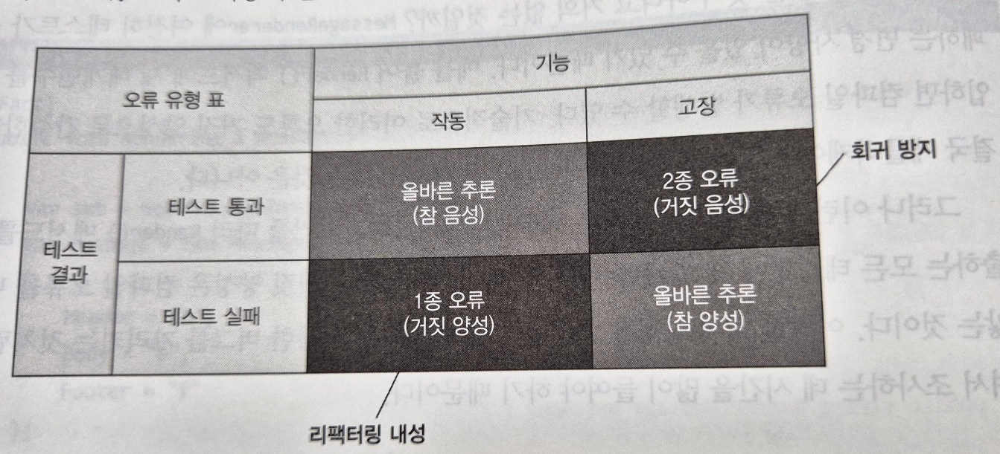
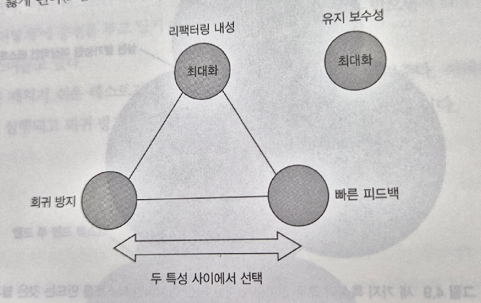
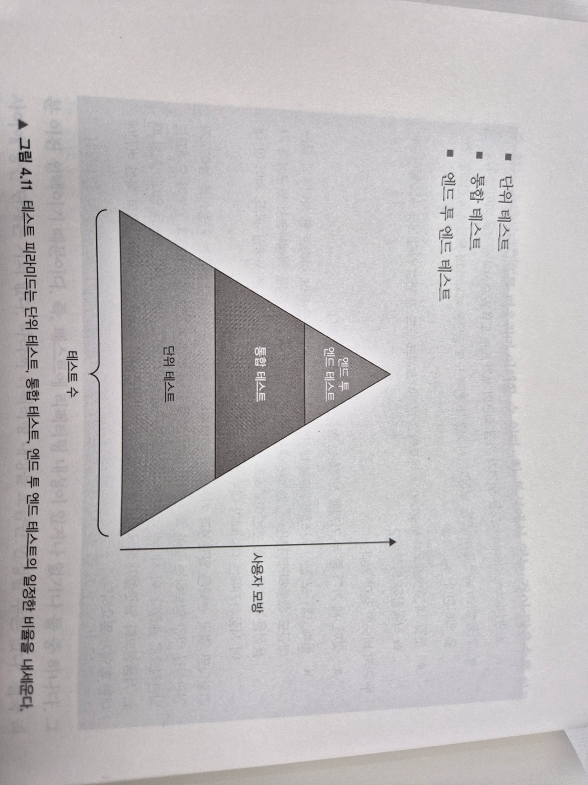

# 2부 4장. 좋은 단위테스트의 4대 요소

1. 좋은 단위테스트의 관점 간 차이점
2. 이상적인 테스트 정의
3. 테스트 피라미드 이해
4. 블랙박스 테스트 및 화이트박스 테스트 사용

## (1장) 좋은 단위테스트 스위트의 특성
1. 개발 주기에 통합돼있다. 실제로 사용하는 테스트만 가치가 있다.
2. 코드베이스의 가장 중요한 부분만을 대상으로 한다. 모든 실행 코드에 똑같이 신경쓸 필요가 없다. 애플리케이션의 핵심(도메인 모델)을 다른 것과 구분하는 것이 중요하다.
3. 최소한의 유지비로 최대 가치를 끌어낸다. 
   1. 가치있는 테스트 식별 - 2장에서 볼 내용. 테스트 스위트의 모든 테스트를 분석할 수 있는 범용 기준틀 소개
   2. 가치있는 테스트 작성


## 4.1. 좋은 단위테스트의 4대 요소

> 아래 4가지 요소는 단위테스트/통합테스트/E2E테스트 모두 적용 가능.

1. 회귀 방지
2. 리팩터링 내성
3. 빠른 피드백
4. 유지 보수성

### 1. 회귀 방지
회귀: 코드를 수정한 후 기능이 의도한대로 작동하지 않는 버그.     
> 프로그래밍을 하는 삶에 있어 불행한 사실은 코드가 자산이 아니라 책임이라는 점이다.   
> 코드베이스가 커질수록 잠재적인 버그에 더 많이 노출된다.   

일반적으로 실행되는 코드가 많을수록 테스트에서 회귀가 나타날 가능성이 높다.
회귀 방지 지표에 대한 테스트 점수가 얼마나 잘 나오는지 평가하려면 다음 사항을 고려해야 한다.
- 테스트중 실행되는 코드의 양: 일반적으로 실행되는 코드가 많을수록 테스트에서 회귀가 나타날 가능성이 높음.
- 코드 복잡도: 단순한 코드를 테스트하는 것은 가치가 거의 없다.
- 코드의 도메인 유의성: 복잡한 비즈니스 로직을 나타내는 코드가 boilerplate 코드보다 더 중요하다.
- 직접 작성한 코드 외에 라이브러리, 프레임워크, 프로젝트 외부 시스템을 테스트 범주에 포함시켜서 이러한 의존성에 대한 검증이 올바른지 확인 필요.

팁: 회귀 방지 지표를 극대화하려면 테스트가 가능한 한 많은 코드를 실행하는 것을 목표로 해야 한다.


### 2. 리팩터링 내성
> 테스트를 실패하지 않고 기본 애플리케이션 코드를 리팩터링할 수 있는지에 대한 척도.
> 실제로 기능은 의도한대로 작동하지만 테스트는 실패하는 경우. (거짓 양성, false positive)

이러한 경우, 테스트 스위트에 대한 신뢰가 떨어지며, 리팩터링이 줄어들고, **회귀를 피하려고 코드 변경을 최소화하게 된다.**    
발생 원인: 테스트와 SUT의 구현 세부 사항이 많이 결합할수록 거짓 양성이 더 많이 생긴다.   
==> 해당 **구현 세부사항 대신 최종 결과를 목표로 해야 한다.** 

```java

public class Test {
   // 리팩터링 내성이 없는 잘못된 예 - 결과가 아니라 내부 구현을 검증한다. 
   public void MessageRenderer_uses_correct_sub_renderers() {
      var sut = new MessageRenderer();
      IReadOnlyList<IRenderer> renderers = sut.SubRenderers;

      Assert.Equal(3, renderers.Count);
      Assert.IsAssignableFrom<HeaderRenderer>(renderers[0]);
      Assert.IsAssignableFrom<BodyRenderer>(renderers[1]);
      Assert.IsAssignableFrom<FooterRenderer>(renderers[2]);
   }


   // 리팩터링 내성이 있는 테스트 - 최종 사용자에게 의미있는 결과를 검증한다.
   public void Rendering_a_message() {
	   var sut = new MessageRenderer(); 
	   var message = new Message {
         Header= "h";
		   Body "b";
		   Footer= "f";
      }
	  
      String html = sut.Render(message);
      Assert.Equal("<h1>h</h1><b>b</b><i>f</i>", html);
   }
   
}
 
```

- 두번째 예시는 false positive가 **거의** 없을 것이다.
  - "거의" -> Render() 메소드에 새 매개변수를 도입하면 컴파일 오류가 생길 수 있기 때문에 false positive가 발생할 수 있음.
  - 그러나 이런 종류의 false positive는 컴파일 오류로 바로 보이기 때문에 해결하기 쉬움. (이게 테스트코드 작성하지 않는 것에 대한 변명이 될 순 없다..)


### 회귀 방지와 리팩터링 내성 간의 본질적인 관계


- 거짓 음성: 버그가 있는 코드를 테스트할 때 테스트 실패가 발생하지 않은 경우. ==> 회귀 방지이 도움이 됨.
- 거짓 양성: 버그가 없는 정상 코드를 테스트할 때 테스트 실패하는 경우. ==> 리팩토링 내성이 도움이 됨.
    - 거짓 양성은 프로젝트 초기에는 별로 중요하지 않지만,  코드베이스가 점점 복잡해지게 되면 점점 더 중요해진다.

### 3. 빠른 피드백

테스트 속도가 빠를수록 테스트 스위트에서 더 많은 테스트를 수행할 수 있고 더 자주 실행할 수 있다.    
오래 걸리는 테스트는 자주 실행하지 못하기 때문에 잘못된 방향으로 가면서 시간을 더 낭비하게 된다.

### 4. 유지 보수성

아래 두 가지 주요 요소로 구성.
- 테스트가 얼마나 이해하기 어려운가
- 테스트가 얼마나 실행하기 어려운가: 테스트가 외부 종속성으로 작동하면 DB서버를 재부팅하고 연결하는 등의 의존성을 상시 운영하는 데 시간을 들여야 한다.


## 이상적인 테스트를 만들 수 있는가?

위 네 가지 특성에서 최대 점수를 받는 테스트를 만들 수 있는가? **불가**
- 회귀 방지, 리팩터링 내성, 빠른 피드백은 상호배타적이다.

극단적인 사례 
1. E2E 테스트: 회귀 방지, 리팩터링 내성은 좋지만 빠른 피드백은 나쁘다.
   - 최종 사용자 관점에서 테스트하므로 많은 코드를 테스트하므로 회귀 방지를 훌륭히 한다.
   - 최종 사용자 관점에서 테스트하므로 리팩터링 내성이 좋다.
   - 단점: 속도가 느려 피드백을 빨리 받기가 어렵다.
2. 너무 간단한 테스트: 리팩터링 내성, 빠른 피드백은 좋지만 회귀 방지 기능이 없음.
   - 너무 간단한 테스트는 매우 빠르게 실행되므로 빠른 피드백을 준다.
   - 너무 간단해서 거짓 양성이 생기기도 힘들기 때문에 리팩터링 내성도 좋다.
   - 단점: 검증이 의미가 없다.
3. 깨지기 쉬운 테스트: 회귀 방지, 빠른 피드백은 좋으나 리팩터링 내성이 없음.
    - ex) 검증 시 마지막으로 실행된 DB 쿼리가 어떤 쿼리가 실행되었는지 검증. 
    - `assert.equals("select * from user", sut.lastExecutedStatement);`
    - 리팩터링을 견디지 못하고 해당 기능이 고장났는지와 관계 없이 테스트 실패.

### 결론



- 유지 보수성, 리팩터링 내성 최대: 이해하기 쉬운 테스트, 외부 종속성이 없어 실행하기 쉬운 테스트, 리팩터링에 관계없이 테스트 코드 실행 가능
   - 리팩터링 내성은 있거나 없거나 둘 중 하나라서 조금만 인정할 수는 없음. 
- 회귀 방지, 빠른 피드백 사이의 선택: 실행되는 테스트 코드의 양이 많아야 회귀를 잡을 가능성이 높으나, 그렇게 되면 테스트 속도가 떨어짐


## 대중적인 테스트 자동화 개념 살펴보기
### 테스트 피라미드: 테스트 스위트에서 테스트 유형 간의 일정한 비율



- 피라미드 상단의 테스트가 회귀 방지에 유리하고, 하단은 실행 속도가 빠르다.
- 어느 계층도 리팩터링 내성을 포기하지 않는다.
  - 예외: 비즈니스 로직이나 복잡도가 거의 없는 기본적인 CRUD 애플리케이션 (AIBOT3.0 CMS?)
    - 단위테스트와 통합테스트 비중이 같고 (또는 통합테스트 > 단위테스트), E2E 테스트가 없음.
    - 단위테스트가 유용하지 않으므로 간단한 테스트만 하고, DB같은 다른 시스템과 연동되는 통합테스트가 더 잘 작동한다.

### 블랙박스 테스트와 화이트박스 테스트 간의 선택
1. 블랙박스 테스트: 시스템 내부 구조를 몰라도 기능을 검사할 수 있는 테스트 방법. 요구사항, 명세로부터 테스트를 구축한다.
2. 화이트박스 테스트: 시스템 내부 작업을 검증하는 테스트 방법. 소스코드로부터 테스트를 만든다.

<table>
<thead>
<th></th>
<th>회귀 방지</th>
<th>리팩터링 내성</th>
<th>비즈니스 담당자가 이해하기 쉬운가</th>
<th>테스트 작성 방법으로</th>
</thead>
<tbody>
<tr>
<th>화이트박스 테스트</th>
<td>좋음</td>
<td>나쁨</td>
<td>나쁨</td>
<th>비추천</th>
</tr>
<tr>
<th>블랙박스 테스트</th>
<td>나쁨</td>
<td>좋음</td>
<td>좋음</td>
<th>권장</th>
</tr>
</tbody>
</table>

- 화이트박스 테스트: 테스트 대상 코드의 특정 구현과 결합되어 있기 때문에 리팩터링 내성에 약하다.
- 테스트 작성 방법으로: 블랙박스 테스트
  - 모든 테스트가 시스템을 블랙박스로 보게 하고 문제 영역에 의미있는 동작을 확인하라.
  - 유일한 예외: 알고리즘 복잡도가 높은 유틸리티 코드를 다루는 경우.
- 테스트 분석 방법으로: 화이트박스 테스트. 
  - 코드 커버리지 도구를 사용해서 어떤 코드 분기를 실행하지 않았는지 확인한 다음 코드 내부 구조에 대해 전혀 모르는 것처럼 테스트하기.
