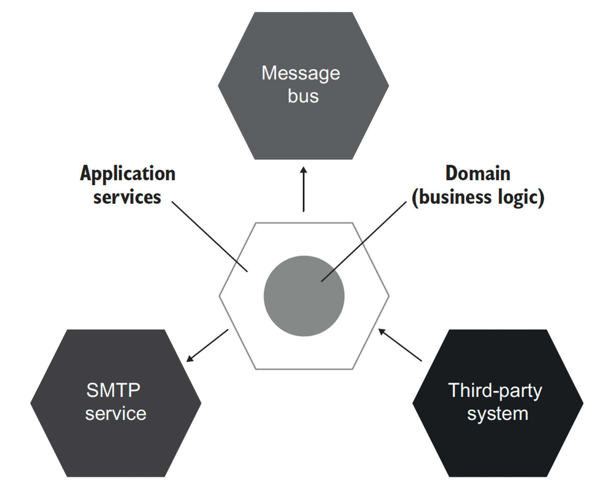

# 2부 5장. 목과 테스트 취약성

1. 목과 스텁 구분
2. 식별할 수 있는 동작과 구현 세부 사항 정의
3. 목과 테스트 취약성 간의 관계 이해
4. 리팩터링 내성 저하 없이 목 사용하기

## 목과 스텁 구분
### 테스트 대역(test double) 유형

테스트 대역: 모든 유형의 비운영용 가짜 의존성.
- 테스트 대상 시스템(SUT)으로 실제 의존성 대신 전달되므로 설정이나 유지보수가 어려울 수 있음.
- dummy, stub, spy, mock, fake - 5가지가 있음


- 목: 외부로 나가는 상호작용을 모방. SUT가 상태 변경을 하기 위한 의존성 호출.
  - 목: 프레임워크의 도움을 받아 생성. 관련 의존성으로 나가는 상호 작용을 모방하고 검사.
  - 스파이: 수동으로 작성
- 스텁: 내부로 들어오는 상호작용 모방. SUT가 입력 데이터를 얻기 위한 의존성 호출.
  - 더미: null값이나 가짜 문자열같이 단순하고 하드코딩된 데이터. SUT의 메서드 시그니처를 만족시키기 위해 사용하고, 최종 결과를 만드는 데에 영향을 주지 않음
  - 스텁: 시나리오마다 다른 값을 반환할 수 있게, 필요한 것을 다 갖춘 완전한 의존성. 내부로 들어오는 상호 작용을 모방만 하고 검사하지 않는다. (검사하는 건 안티패턴)
  - 페이크: 스텁과 동일하지만 아직 존재하지 않는 의존성 대체하기 위해 구현
- 명령을 대체하는 테스트 대역은 목, 조회를 대체하는 테스트 대역은 스텁.
  - Command Query Separation (CQS) 원칙
  - 목: `mock.Verify( x -> x.SendGreetingsEmail("user@email.com"), Times.Once);`
  - 스텁: `stub.Setup(x -> x.GetNumberofUsers()).Returns(10);`


### 도구로서의 Mock과 실제 테스트 대역으로서의 목을 구분하기

```java
public class Test {

  // 도구로서의 목, 테스트 대역으로서의 목 사용 예시
  public void Sending_a_greetings_email() {
    var mock = new Mock<IEmailGateway>();  // 도구로서의 mock 생성.
    var sut = new Controller(mock.Object);
    sut.GreetUser("user@email.com");

    mock.Verify( x -> x.SendGreetingsEmail("user@email.com"), Times.Once); // 테스트 대역으로서의 mock. SUT 테스트 결과(메일 전송 여부)를 검사한다.
  }

  // 도구로서의 목, 테스트 대역으로서의 스텁 사용 예시
  public void Creating_a_report() {
    var stub = new Mock<IDatabase>(); // Mock 클래스를 도구로 사용하여, 테스트 대역으로서의 **스텁** 생성
    stub.Setup(x -> x.GetNumberofUsers()).Returns(10); // 준비한 응답 설정(스텁)

    var sut = new Controller(stub.Object);
    Report report = sut.CreateReport();

    Assert.Equal(10, report.NumberofUsers);
  }
}
```

## 식별할 수 있는 동작과 구현 세부 사항 - 무엇을 테스트해야 하는가?

구현 세부 사항이 아닌 **식별할 수 있는 동작**을 테스트해야 한다.

#### 식별할 수 있는 동작의 조건
1. 클라이언트가 목표를 달성하는 데에 도움이 되는 연산
2. 클라이언트가 목표를 달성하는 데에 도움이 되는 상태

==> 식별할 수 있는 동작은 public 메소드/필드로 노출하고, 나머지는 모두 private.


#### 구현 세부 사항 유출 예시: 연산유출
- User는 이름의 길이가 50자가 넘으면 잘라서 저장해야 하는 불변 조건이 있다고 가정했을 때,
- 아래 사용자 이름을 변경하는 `renameUser` 메소드 내부에서, User 클래스에서 사용자 이름 변경이라는 목표를 달성하는 부분은?  `user.setName()` 한군데.
- `user.normalizeName(newName)`; 는 구현 세부사항 노출이다. 비공개 메소드로 변경하고, setName() 안에서 호출하도록 변경해야 한다.
```java
public class User {

  private String name;

  public void setName(String newName) {
    this.name = newName;
  }

  public String normalizedName(String name) {
    String result = name.trim();
    if(result.length > 50) {
      return result.substring(0, 50);
    }
    return result;
  }
}

public class UserController {
  /**
   * 사용자 이름을 변경한다.
   * @param userId
   * @param newName
   */
  public void renameUser(int userId, String newName) {
    User user = getUserFromDb(userId);

    String normalizedName = user.normalizeName(newName);
    user.setName(normalizedName); // 사용자 이름 변경이라는 목표를 달성하는 부분
    saveUserToDb(user);
  }
}
```

```java
public class User {

  private String name;

  public void setName(String newName) {
    this.name = normalizedName(newName);
  }

  private String normalizedName(String name) {
    String result = name.trim();
    if(result.length > 50) {
      return result.substring(0, 50);
    }
    return result;
  }
}

public class UserController {
  /**
   * 사용자 이름을 변경한다.
   * @param userId
   * @param newName
   */
  public void renameUser(int userId, String newName) {
    User user = getUserFromDb(userId);
    user.setName(normalizedName);
    saveUserToDb(user);
  }
}
```
#### 클래스가 구현 세부 사항을 유출하는지 판단하는 데 도움이 되는 규칙
단일한 목표를 달성하고자 클래스에서 호출해야 하는 연산의 수가 1보다 크면 해당 클래스에서 구현 세부 사항을 유출할 가능성이 있다.       
아래 예제는 이름 변경을 위해 두 가지 작업을 사용해야 했다.   
리팩터링으로 setName 안에서 normalizeName을 호출하도록 하면 연산 수가 1로 감소한다.


#### 구현 세부 사항 유출 예시: 상태노출
```java
public interface Renderer {
  String render(Message message);
}

public class HtmlRenderer implements Renderer {

  private List<Renderer> subRenderes;

  public List<Renderer> getSubRenderes() {
    return subRenderes;
  }

  public HtmlRenderer() {
    subRenderers.add(new HeaderRenderer());
    subRenderers.add(new BodyRenderer());
    subRenderers.add(new FooterRenderer());
  }

  @Overide
  public String render(Message message) {
    return subRenderes.stream()
            .map(x -> x.render(message))
            .collect(Collectors.joining(""));
  }
}
```
## 목과 테스트 취약성 간의 관계
### 육각형 아키텍처란?

#### 애플리케이션 서비스 계층
- 도메인 계층 위에서 외부 환경과의 통신을 조정
- 데이터베이스를 조회하고 해당 데이터로 도메인 클래스 인스턴스 구체화
- 해당 인스턴스에 연산 호출
- 결과를 데이터베이스에 다시 저장

#### 도메인 계층
- 비즈니스 로직 수행



#### 육각형 아키텍처 애플리케이션 테스트에서 목 사용하기
- 애플리케이션 서비스 계층와 연동된 외부 서비스는 목 사용 가능
- 도메인 계층에서의 목 사용은 깨지기 쉬운 테스트를 만들 가능성이 있으므로 지양
