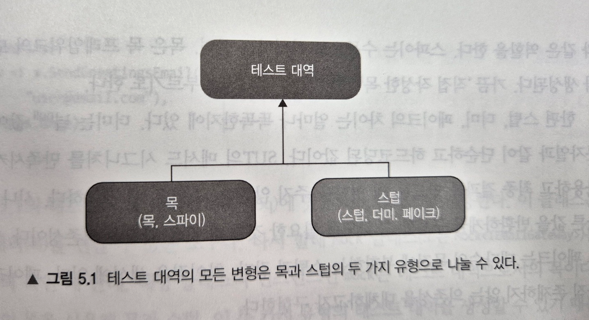

# 2부 5장. 목과 테스트 취약성

1. 목과 스텁 구분
2. 식별할 수 있는 동작과 구현 세부 사항 정의
3. 목과 테스트 취약성 간의 관계 이해
4. 리팩터링 내성 저하 없이 목 사용하기

## 목과 스텁 구분
### 테스트 대역(test double) 유형

테스트 대역: 모든 유형의 비운영용 가짜 의존성.
- 테스트 대상 시스템(SUT)으로 실제 의존성 대신 전달되므로 설정이나 유지보수가 어려울 수 있음.
- dummy, stub, spy, mock, fake - 5가지가 있음



- 목: 외부로 나가는 상호작용을 모방. SUT가 상태 변경을 하기 위한 의존성 호출.
  - 목: 프레임워크의 도움을 받아 생성. 관련 의존성으로 나가는 상호 작용을 모방하고 검사.
  - 스파이: 수동으로 작성
- 스텁: 내부로 들어오는 상호작용 모방. SUT가 입력 데이터를 얻기 위한 의존성 호출.
    - 더미: null값이나 가짜 문자열같이 단순하고 하드코딩된 데이터. SUT의 메서드 시그니처를 만족시키기 위해 사용하고, 최종 결과를 만드는 데에 영향을 주지 않음
    - 스텁: 시나리오마다 다른 값을 반환할 수 있게, 필요한 것을 다 갖춘 완전한 의존성. 내부로 들어오는 상호 작용을 모방만 하고 검사하지 않는다. (검사하는 건 안티패턴)
    - 페이크: 스텁과 동일하지만 아직 존재하지 않는 의존성 대체하기 위해 구현
- 명령을 대체하는 테스트 대역은 목, 조회를 대체하는 테스트 대역은 스텁.
  - Command Query Separation (CQS) 원칙
  - 목: `mock.Verify( x -> x.SendGreetingsEmail("user@email.com"), Times.Once);`
  - 스텁: `stub.Setup(x -> x.GetNumberofUsers()).Returns(10);`


### 도구로서의 Mock과 실제 테스트 대역으로서의 목을 구분하기

```java
public class Test {
	
	// 도구로서의 목, 테스트 대역으로서의 목 사용 예시
	public void Sending_a_greetings_email() {
		var mock = new Mock<IEmailGateway>();  // 도구로서의 mock 생성.
		var sut = new Controller(mock.Object);
		sut.GreetUser("user@email.com");

		mock.Verify( x -> x.SendGreetingsEmail("user@email.com"), Times.Once); // 테스트 대역으로서의 mock. SUT 테스트 결과(메일 전송 여부)를 검사한다.
	}

	// 도구로서의 목, 테스트 대역으로서의 스텁 사용 예시
	public void Creating_a_report() {
		var stub = new Mock<IDatabase>(); // Mock 클래스를 도구로 사용하여, 테스트 대역으로서의 **스텁** 생성
		stub.Setup(x -> x.GetNumberofUsers()).Returns(10); // 준비한 응답 설정(스텁)

		var sut = new Controller(stub.Object);
		Report report = sut.CreateReport();
		
		Assert.Equal(10, report.NumberofUsers);
	}
}
```

## 식별할 수 있는 동작과 구현 세부 사항 - 무엇을 테스트해야 하는가?

구현 세부 사항이 아닌 **식별할 수 있는 동작**을 테스트해야 한다.

#### 식별할 수 있는 동작의 조건
1. 클라이언트가 목표를 달성하는 데에 도움이 되는 연산
2. 클라이언트가 목표를 달성하는 데에 도움이 되는 상태

==> 식별할 수 있는 동작은 public 메소드/필드로 노출하고, 나머지는 모두 private.


#### 구현 세부 사항 유출 예시
- User는 이름의 길이가 50자가 넘으면 잘라서 저장해야 하는 불변 조건이 있다고 가정했을 때,
- 아래 사용자 이름을 변경하는 `renameUser` 메소드 내부에서, User 클래스에서 사용자 이름 변경이라는 목표를 달성하는 부분은?  `user.setName()` 한군데.
- `user.normalizeName(newName)`; 는 구현 세부사항 노출이다. 비공개 메소드로 변경하고, setName() 안에서 호출하도록 변경해야 한다.
```java
public class UserController {
  /**
   * 사용자 이름을 변경한다.
   * @param userId
   * @param newName
   */
  public void renameUser(int userId, String newName) {
		User user = getUserFromDb(userId);
		
		String normalizedName = user.normalizeName(newName);
		user.setName(normalizedName); // 사용자 이름 변경이라는 목표를 달성하는 부분
		
		saveUserToDb(user);
    }
}
```


#### 클래스가 구현 세부 사항을 유출하는지 판단하는 데 도움이 되는 규칙
단일한 목표를 달성하고자 클래스에서 호출해야 하는 연산의 수가 1보다 크면 해당 클래스에서 구현 세부 사항을 유출할 가능성이 있다.       
아래 예제는 이름 변경을 위해 두 가지 작업을 사용해야 했다.   
리팩터링으로 setName 안에서 normalizeName을 호출하도록 하면 연산 수가 1로 감소한다.   

```java
String normalizedName = user.normalizeName(newName);
user.setName(normalizedName);
```

## 목과 테스트 취약성

### 헥사고날 아키텍처 (aka 포트와 어댑터 아키텍처)
- 도메인 계층은 해당 비즈니스 로직에 대해서만 책임을 져야 하며, 다른 모든 책임에서는 제외돼야 한다.
- 외부 애플리케이션과 통신하거나 DB에서 데이터를 검색하는 것과 같은 책임은 애플리케이션 서비스에 귀속되어야 한다.
- 애플리케이션 서비스에는 어떤 비즈니스 로직도 있으면 안된다.


- 육각형 안에는 도메인 엔터티와 이와 상호작용하는 비즈니스 로직(UseCase)가 있다.
  - usecase: 인터페이스
  - port: usecase 구현
- 육각형 바깥에는 애플리케이션과 상호작용하는 어댑터가 있다. 일부 어댑터는 외부 시스템과 상호작용하며, 데이터베이스와 상호 작용하는 어댑터도 있다.
  - 어댑터와 애플리케이션 코어 간 통신을 할 때는 각각의 포트를 사용해야 한다.

- 패키지 구조 (만들면서 배우는 클린 아키텍처)
```
payment-system
        ㄴ account
            ㄴ adapter // 프레임워크 헥사곤. 
                ㄴ in
                    ㄴ web
                        ㄴ AccountController
                ㄴ out
                    ㄴ persistence // out port 구현
                        ㄴ AccountPersistenceAdapter
                        ㄴ SpringDataAccountRepository
            ㄴ domain // 도메인 헥사곤
                ㄴ Account
                    ㄴ Activity
            ㄴ application  // 어플리케이션 헥사곤
                ㄴ SendMoneyService 
                ㄴ port    // application 계층의 incoming 포트와 outgoing 포트
                    ㄴ in
                        ㄴ SendMoneyUseCase // 
                    ㄴ out
                        ㄴ LoadAccountPort
                        ㄴ UpdateAccountStatePort
```

### 취약한 테스트로 이어지지 않는 목 사용
- 목을 외부 의존성을 검증하기 위해 사용하면 취약한 테스트로 이어지지 않음. 

```java

public class Test {
	public void successful_purchase() {
		var mock = new Mock<IEmailGateway>();
		var sut = new CustomerController(mock.Object);
		
		boolean isSuccess = sut.purchase(1, 2, 5);
		
		Assert.True(isSuccess);
        mock.verify(x -> x.sendReceipt("customer@gmail.com", "shampoo", 5), Times.Once);
    }
}

```


### 취약한 테스트로 이어지는 목 사용
- 목을 내부 클래스 간 통신 검증에 사용하면 취약한 테스트로 이어지게 된다.

```java

public class Test {
	public void purchase_succeeds_when_enough_inventory() {
		var storeMock = new Mock<Store>();
        storeMock.setup(x -> x.hasEnoughInventory(Shampoo, 5))
                .returns(true);
        var customer = new Customer();
	  
		boolean success = customer.purchase(storeMock.Object, Shampoo, 5);
		
		Assert.True(isSuccess);
        mock.verify(x -> x.removeInventory(Shampoo, 5), Times.Once); // 
    }
}

```


## 단위테스트의 고전파 런던파 재고

<table>
<thead>
<th></th>
<th>격리 주체</th>
<th>단위의 크기</th>
<th>테스트 대역 사용 대상</th>
</thead>

<tbody>
<tr>
<th>런던파</th>
<td>단위</td>
<td>단일 클래스</td>
<td>불변 의존성 외 모든 의존성</td>
</tr>
<tr>
<th>고전파</th>
<td>단위 테스트</td>
<td>단일 클래스 또는 클래스 세트</td>
<td>공유 의존성</td>
</tr>
</tbody>
</table>

- 런던파: 불변의존성을 제외한 모든 의존성에 목 사용을 권장하며, 시스템 내 통신과 시스템 간 통신을 구분하지 않는다.
  - ==> 목을 무분별하게 사용되어, 구현 세부사항과 목이 결합되어 테스트에 리팩터링 내성이 없어진다.
- 고전파: 테스트 간에 공유하는 의존성만 목을 사용하자고 하므로 리팩터링 내성에 유리. 그러나 이상적이진 않다

### 모든 프로세스 외부 의존성을 목으로 해야 하는 것은 아니다.
각 테스트 실행 전에 데이터베이스를 인스턴스화하면 테스트 스위트가 너무 느려진다. 그러나,,        
모든 프로세스 외부 의존성을 목으로 해야 하는건 아니다.     
**프로세스 외부 의존성을 애플리케이션을 통해서만 접근할 수 있으면(DB같이) 이러한 의존성과의 통신은 시스템에서 식별할 수 있는 동작이 아니다. 애플리케이션의 일부**로 봐야 한다.   


- 리팩터링 후에 그대로 유지할 필요가 없으므로 목으로 검 
